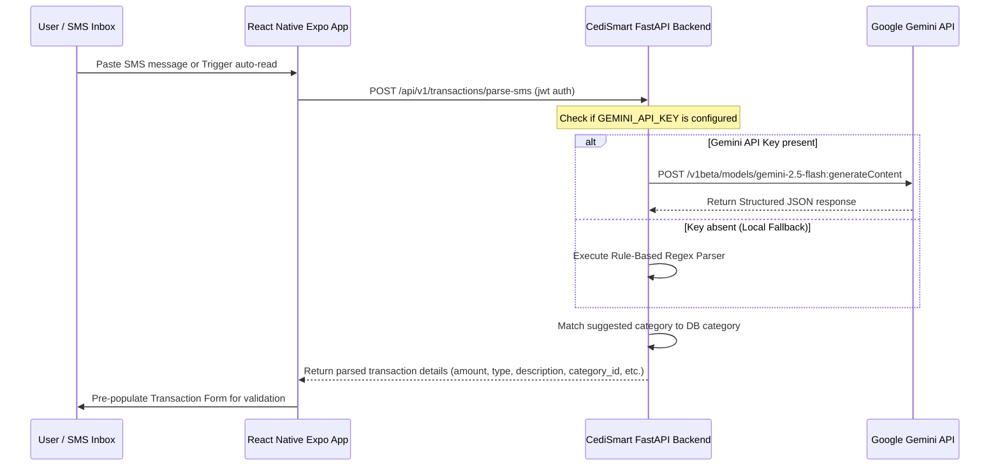

# Gemini 2.5 Flash SMS Parser Integration Guide

This guide details how to integrate the **Gemini 2.5 Flash** model (via Google AI Studio Free Tier) into CediSmart to automatically parse transaction notification SMS alerts (e.g. from MTN Mobile Money, Telecel Cash, and AT Money) into structured ledger records.

---

## 🏗️ Architecture Overview

To protect sensitive API credentials and ensure optimal mobile performance, the SMS parsing flow is structured as follows:



---

## 🔒 1. Gemini Security & API Costs

### 🔑 API Key Format & Custody
> [!IMPORTANT]
> **Never store the `GEMINI_API_KEY` inside the mobile client codebase or package bundle.**
> Embedding API keys in React Native makes them easily extractable via reverse-engineering (e.g., decompiling the APK). Always route requests through the secure FastAPI backend where the API key is retrieved from environment variables.

* **Key Format Update**: Modern Google AI Studio keys generated for developers now start with the **`AQ.`** prefix (replacing legacy keys starting with `AIzaSy`). Both key formats are fully supported, but you must pass them to the standard URL query param `?key=YOUR_API_KEY`.

### 💰 Free Tier & Rate Limits
Google AI Studio offers a **Free Tier** for the **Gemini 2.5 Flash** model. This is perfect for CediSmart, as transaction parses do not require premium latency, and the input/output context sizes are extremely small.

| Metric | Free Tier Allowance | Details |
| :--- | :--- | :--- |
| **Price** | **$0.00** | Completely free to use |
| **Rate Limit (RPM)** | **15 RPM** | 15 requests per minute |
| **Rate Limit (TPM)** | **1 Million TPM** | 1 million tokens per minute |
| **Daily Limit (RPD)** | **1,500 RPD** | 1,500 requests per day |

*For users exceeding these limits, the backend gracefully falls back to a local, regex-based heuristic engine with zero user disruption.*

---

## ⚙️ 2. Backend Integration & Prompt Design

### 📝 Prompt Engineering
To guarantee consistent outputs, the prompt defines the input source and requires the model to output *only* valid JSON matching our database schemas.

We leverage Gemini's native **Structured Outputs** (`responseMimeType: "application/json"` with `responseSchema`) to enforce a strict JSON schema at the API level, ensuring no markdown wraps or invalid formats are returned.

#### JSON schema sent to Gemini:
```json
{
  "type": "OBJECT",
  "properties": {
    "amount": {"type": "NUMBER"},
    "transaction_type": {"type": "STRING", "enum": ["income", "expense"]},
    "description": {"type": "STRING"},
    "category_suggestion": {"type": "STRING"},
    "notes": {"type": "STRING"}
  },
  "required": ["amount", "transaction_type", "description"]
}
```

### 🛰️ API Configuration
Add the following key to your `.env` file on the backend server:
```bash
# CediSmart API Configuration
GEMINI_API_KEY="your-api-key-here"
```

---

## 📱 3. Frontend React Native Implementation

The mobile app receives the parsed payload, pre-fills the manual entry flow, and prompts the user to review before confirming.

### 🧩 SMS Parsing React Hook
Create a hook or function to call the backend parser:

```typescript
import apiClient from '../api/client';

export interface ParsedTransaction {
  amount: number;
  transaction_type: 'income' | 'expense';
  description: string;
  category_id: string | null;
  category_name: string;
  notes: string;
}

export const parseSMSAlert = async (rawSMS: string): Promise<ParsedTransaction> => {
  try {
    const response = await apiClient.post('/transactions/parse-sms', {
      sms: rawSMS,
    });
    return response.data;
  } catch (error) {
    console.error('Failed to parse SMS transaction:', error);
    throw error;
  }
};
```

### 🎨 Pre-populating the UI Form
In your transaction creation flow, add an "AI Paste" action. When a user pastes a MoMo text message, trigger the parser and load the values into the form:

```tsx
import React, { useState } from 'react';
import { View, TextInput, TouchableOpacity, Text, ActivityIndicator } from 'react-native';
import { parseSMSAlert } from '../../utils/api';
import * as Haptics from 'expo-haptics';

const AIPasteInput = ({ onParsed }: { onParsed: (data: any) => void }) => {
  const [inputText, setInputText] = useState('');
  const [loading, setLoading] = useState(false);

  const handleParse = async () => {
    if (!inputText.trim()) return;
    setLoading(true);
    try {
      Haptics.selectionAsync().catch(() => {});
      const result = await parseSMSAlert(inputText);
      
      // Notify parent component to update form values
      onParsed(result);
      setInputText('');
      
      Haptics.notificationAsync(Haptics.NotificationFeedbackType.Success).catch(() => {});
    } catch (err) {
      Haptics.notificationAsync(Haptics.NotificationFeedbackType.Error).catch(() => {});
      alert('Could not parse SMS. Please check format or enter manually.');
    } finally {
      setLoading(false);
    }
  };

  return (
    <View style={{ padding: 16, backgroundColor: '#1f2937', borderRadius: 12, margin: 12 }}>
      <Text style={{ color: '#fff', fontWeight: 'bold', marginBottom: 8 }}>
        ✨ Paste MoMo / SMS Alert
      </Text>
      <TextInput
        placeholder="Paste MTN MoMo or Telecel Cash SMS alert..."
        placeholderTextColor="#9ca3af"
        value={inputText}
        onChangeText={setInputText}
        multiline
        style={{
          backgroundColor: '#374151',
          color: '#fff',
          borderRadius: 8,
          padding: 10,
          minHeight: 60,
          textAlignVertical: 'top',
        }}
      />
      <TouchableOpacity
        onPress={handleParse}
        disabled={loading}
        style={{
          backgroundColor: '#10b981',
          padding: 12,
          borderRadius: 8,
          alignItems: 'center',
          marginTop: 10,
        }}
      >
        {loading ? (
          <ActivityIndicator color="#fff" />
        ) : (
          <Text style={{ color: '#fff', fontWeight: '600' }}>Parse & Autofill</Text>
        )}
      </TouchableOpacity>
    </View>
  );
};
```

---

## 🧪 4. Testing & Verification

We have automated integration test coverage to guarantee the parser functions correctly even when offline or without an active API key.

### Run tests:
```bash
# Execute transaction unit tests
./.venv/bin/pytest tests/modules/test_transactions.py -v
```

### Example SMS formats handled:
1. **MTN MoMo Deposit (Income):**
   `"Payment received of GHS 150.00 from John Doe."`
   *Expected Parse:* Amount: `150.00`, Type: `income`, Description: `John Doe`
2. **Telecel Cash Transfer (Expense):**
   `"You have sent GHS 45.00 to Telecel Bundle."`
   *Expected Parse:* Amount: `45.00`, Type: `expense`, Description: `Telecel Bundle`
